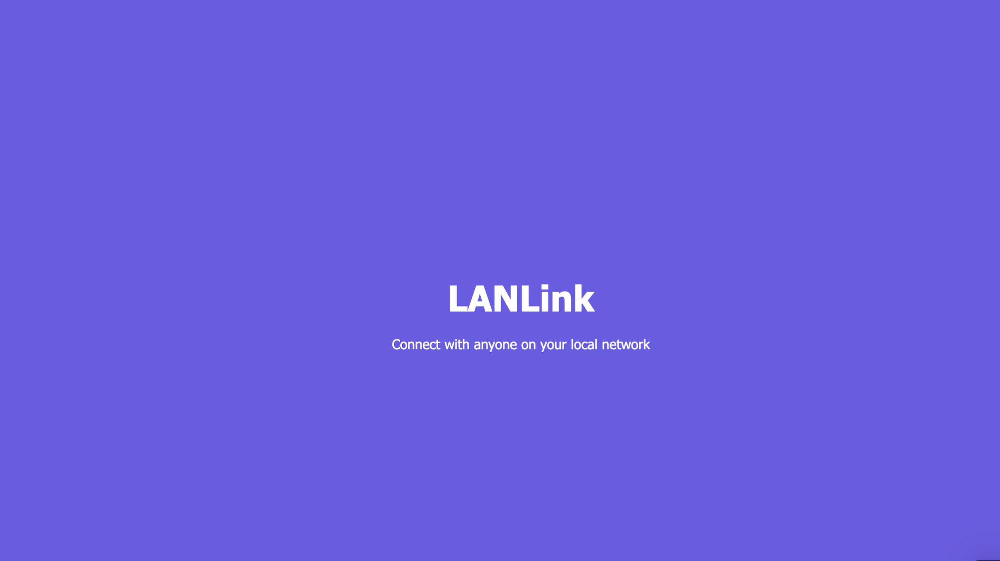
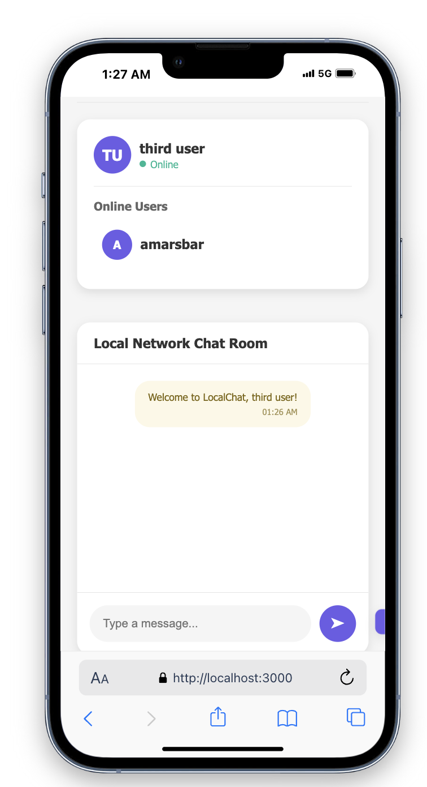
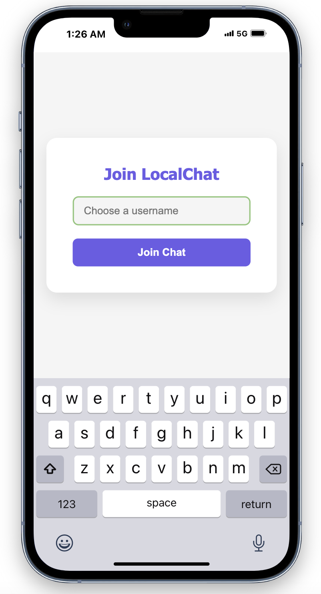
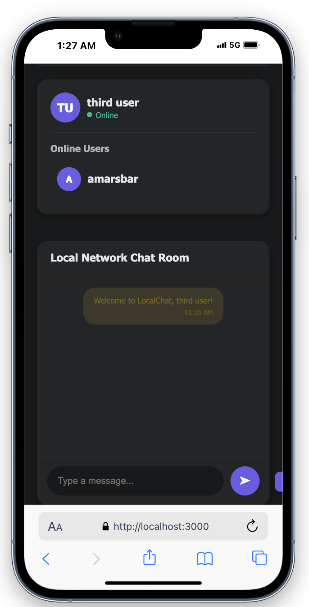
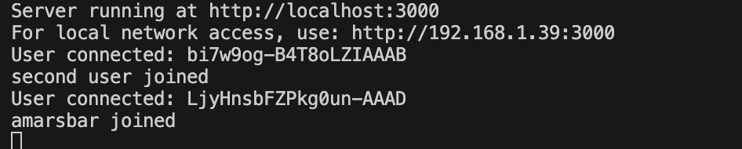
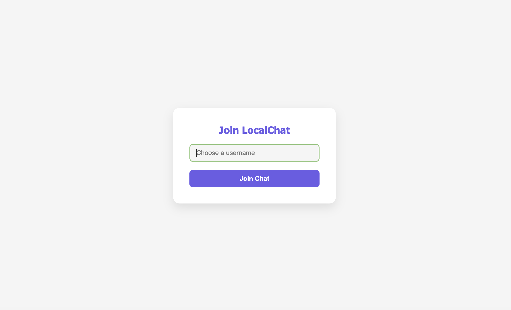

# 🌐 LanLink

*Connect with anyone on your local network, instantly.*

## What is LanLink?

LanLink is a sleek, modern web application that enables real-time communication between users on the same local network. With its intuitive interface, smooth animations, and feature-rich environment, NexusChat transforms local network communication into an engaging experience.

## ✨ Features

- **Real-time Messaging** - Instantly communicate with anyone on your local network
- **Dark & Light Mode** - Toggle between themes with your preference saved automatically
- **User Status** - See who's online and active in the chat
- **Typing Indicators** - Know when someone is composing a message
- **Responsive Design** - Works perfectly on both desktop and mobile devices
- **Smooth Animations** - Enjoy a polished user experience with beautiful transitions
- **Notifications** - Get alerted when new messages arrive or users join

## 🚀 Getting Started

Setting up LanLink is quick and easy:

1. Clone this repository
2. Install dependencies with `npm install`
3. Start the server with `npm start`
4. Share the local network URL with others
5. Begin chatting!

## 🔧 How It Works

LanLink uses a powerful yet simple technology stack:

- **Frontend**: HTML5, CSS3, and JavaScript create a responsive and interactive UI
- **Backend**: Node.js with Express provides a lightweight and efficient server
- **Real-time Communication**: Socket.IO enables instant message delivery and status updates
- **Network Discovery**: Automatic IP detection makes sharing the app with others effortless

When you start the server, it automatically identifies your local IP address and creates a URL that anyone on your network can access. Each user chooses a username, and the server manages all connections, message distribution, and status updates.

## 📱 User Experience

The app opens with a stylish welcome animation before prompting users to choose a username. Once connected, users can:

- Send and receive messages in real time
- See when others are typing
- Toggle between light and dark themes
- View who's currently online
- Receive notifications for new messages and user activity

## 🛠️ Technical Details

NexusChat's architecture consists of three main components:

1. **Client-side Application**: Handles UI rendering, user interactions, and Socket.IO client connections
2. **Express Server**: Serves static files and manages HTTP connections
3. **Socket.IO Server**: Manages WebSocket connections for real-time communication

The application uses event-driven programming to handle user actions and server responses, creating a smooth and responsive experience.

## 📦 Deployment

To deploy LanLink on your own network:

1. Ensure Node.js is installed on your computer
2. Clone or download this repository
3. Navigate to the project directory
4. Run `npm install` to install dependencies
5. Start the server with `npm start`
6. Access the application at the URL displayed in the terminal
7. Share this URL with others on your network

## 🤝 Contributing

Contributions are welcome! Feel free to submit pull requests or open issues to improve LanLink.

## 📝 License

This project is licensed under the MIT License - see the LICENSE file for details.

## 📸 More Screenshots

---
